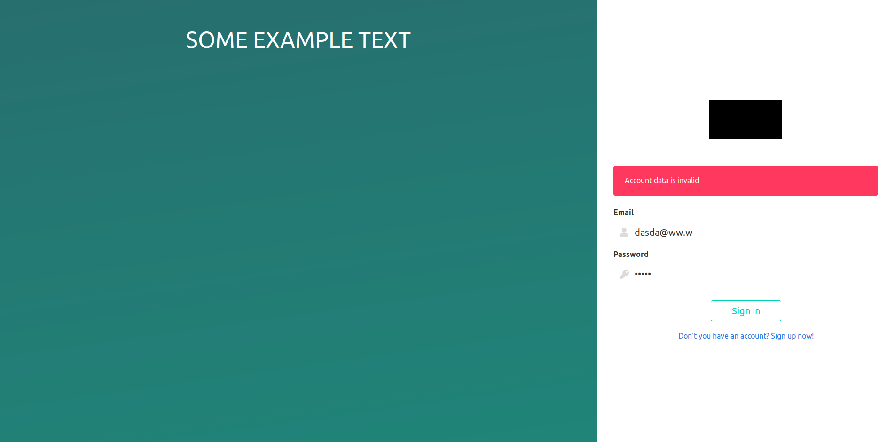

# React app with Spring Backend

## Description

This is simple React App with Spring Backed.

### Screenshots

Homepage


Sign In




Sign up


## Features

- [x] Spring app with oAuth2 authorization
- [x] Zuul
- [x] React app (Homepage, Sign in, Sign up, error pages)
- [x] Bulma style

### Plans

- [ ] Social media login (Facebook, Twitter)
- [ ] Swagger

## Installation

```shell script
git clone git@github.com:cv65kr/react_spring.git
cd react_spring
make services
make build
make up
```

App is available on `http://127.0.0.1/`.